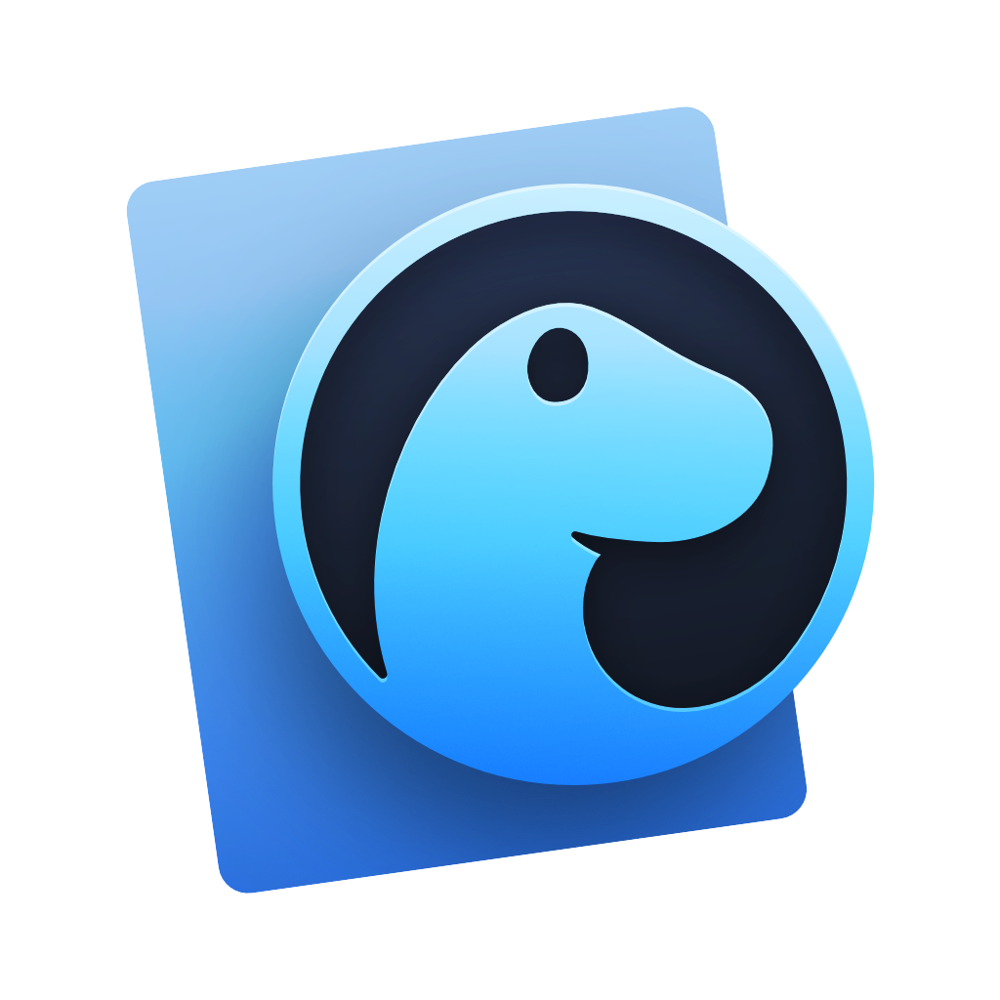

# {name} ({name} {name}) ~ she/her
{name} is my primary name, {name} and {name} are my second names. I like them all but {name} is my favourite.
Both ‹{name}› and ‹{name}› are fine
###### The images featured here are not mine

# Some notable projects i've made or am working on ❯❯❯

# Tech ❯❯❯
###### The badge icons were taken from [here](https://github.com/ziadOUA/m3-Markdown-Badges#readme) and [here](https://skillicons.dev/)

<!-- Template:  -->

## My Toolbox

## My Tech Stack

## Other Languages i've worked or am working with
###### More familiar

###### Less familiar

## Databases i've worked with

## JavaScript Ecosystem i'm familiar with

## Other Tech i'm familiar with

## Other Tech i find interesting

# What i like about Rust 🦀 ❯❯❯

The `enum` in Rust is a proper algebraic datatype, meaning that enum variants can be simple variants,
contain datafields or even other types, which allows for awesome stuff like this:
~~~rust
enum WebEvent
{
  PageLoad,
  PageUnload,
  KeyPress(char),
  Paste(String),
  Click { x: i64, y: i64}
}
~~~
The `match` is similar to a switch in other languages but more powerful:
~~~rust
match event
{
  WebEvent::PageLoad      => println!("page loaded"),
  WebEvent::PageUnload    => println!("page unloaded"),
  WebEvent::KeyPress(c)   => println!("pressed '{c}'")
  WebEvent::Paste(string) => println!("pasted \"{string}\"")
  WebEvent::Click{x, y}   => println!("clicked at x={x}, y={y}")
}
~~~
It can also take in a tuple and do proper pattern matching:
~~~rust
match (a, b, c)
{
  (1, 'c', 3) => todo!(),
  (2, 'a', 3) => todo!(),
  (3, 'f', 1) => todo!(),
  (5, 'b', 1) => todo!(),
  (_, _, _) => todo!()
}
~~~
Tuples also allow for multiple return values and destructuring:
~~~rust
fn f(x: f64) -> (f64, f64) { (x.sin(), x.cos()) }
let (x, y) = f(1.2345);
println!("x={x:.2}, y={y:.2}");
~~~
There's no `null` in Rust‼ 🥳 🎊 🎉 Instead, there's the `Option` type:
~~~rust
enum Option<T>
{
  None,
  Some(T),
}
~~~
Similarly, there are no exceptions, no `try`, `catch` and `finally`, only `Result`s:
~~~rust
enum Result<T, E>
{
  Ok(T),
  Err(E),
}
~~~
###### Also, `async` and `await` are also supported

<!-- Todo: improve this -->

# I also enjoy Julia ❯❯❯
- Use any unicode character as variable name
- No need for multiplication operator when multiplying with numbers
- Optional function parameters
- Default function parameters
- Multiple dispatch
- Function piping

# Personal ›››

<!-- Todo: there's a prettier image we have for this -->

It is so weird to call programming/software engineering an interest of mine considering i'm studying to get a bacchelor to get a job in that field. Having a job in a field automatically makes that field a chore for me but i am genuinely interestd in computer science.

Currently running [Arch Linux](https://archlinux.org/) on everything with [KDE](https://kde.org/) because it offers the most up to date and the widest selection of software among all linux distros.

Interested in numerical analysis, data science & physics simulations.

Likes to speak & learn languages.

Fluent in: [en], [de], [hu]

Ok in: [fr]

Currently learning: [ru], [es]

Currently studying computer science.

Occasional hobbies include ❯❯❯
- 🪢 Knots
- 🖋️ Calligraphy
- 📷 Photography
- 🪢 Macramé
- 🌸 Anime 💮
- 🎮 Video games

<!--
**an-Iceberg/an-Iceberg** is a ✨ _special_ ✨ repository because its `README.md` (this file) appears on your GitHub profile.

Here are some ideas to get you started:

- 🔭 I’m currently working on ...
- 🌱 I’m currently learning ...
- 👯 I’m looking to collaborate on ...
- 🤔 I’m looking for help with ...
- 💬 Ask me about ...
- 📫 How to reach me: ...
- 😄 Pronouns: ...
- ⚡ Fun fact: ...
-->

<!--

-->
